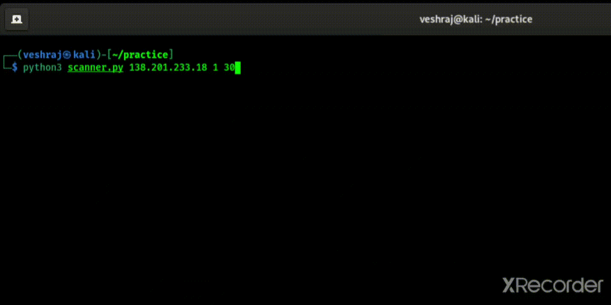

# 🕵🏻‍♀️Port-Scanner 🕵🏻‍♀️
A Simple Port Scanner By newbie 👷

# 🤸 Usage 🤸
U can scan host by specifying starting and ending ports:  
`python3 scanner.py {ip} {startingPort} {endingPort}`  
         or simply,  
`python3 scanner.py {ip}` only

